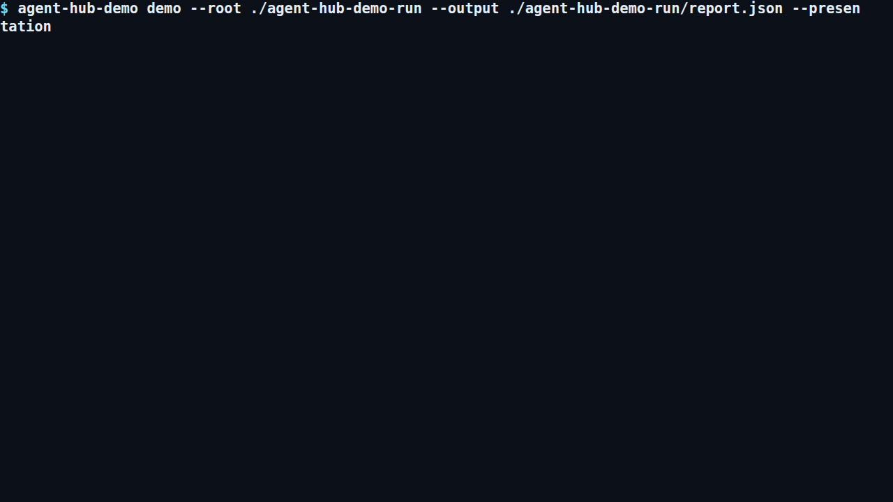

# Agent Hub Demo

Agent Hub Demo is a small reference project for shipping a KFD-compatible
Agent Hub as Buildchain-managed standalone binaries. The release matrix
publishes a detached-signature Linux x64 executable, a Developer ID signed and
notarized macOS arm64 executable, and an explicitly unsigned Windows x64
executable, plus KFD-1/2/3 evidence, checksums, and one independently
verifiable Release Passport. This repository declares desired signature state
only; Buildchain owns credentials, provider jobs, and immutable result delivery.
The exact reviewed Buildchain v4 commit pinned in every production workflow is
the sole build, channel-promotion, publication, and release authority. The
machine-readable Windows exception lives in
`.buildchain/platform-signing-policy.json`; no Authenticode claim is made.

The implementation uses two independent Hubs backed by separate file-based
content-addressed stores. KFD enters through the public npm package at build
time; its exact public profile facts are embedded into the executables, so
released binaries do not require Node.js, npm, a source checkout, or private
packages.

The repository is deliberately small, but the implementation is real. Each Hub
owns a distinct Ed25519 identity, capability document, content-addressed store,
admission state, revocation set, and export bundle. The file binding records
transport receipts while the Hub keeps delivery, admission, and completion as
independent facts.

<!-- agent-hub-demo:auditable-demo:start -->
## Agent Hub Demo standalone binary

[](docs/evidence/auditable-demo/2d6b953f02559dff0369babf1238f2a35826126bc9f64895c3fe58d9229570a5/agent-hub-demo/public-evidence.json)

Animation scenario:

```text
$ agent-hub-demo demo --root ./agent-hub-demo-run --output ./agent-hub-demo-run/report.json --presentation
```

Native renditions: [1080p MP4](docs/evidence/auditable-demo/2d6b953f02559dff0369babf1238f2a35826126bc9f64895c3fe58d9229570a5/agent-hub-demo/demo.mp4) · [1080p WebM](docs/evidence/auditable-demo/2d6b953f02559dff0369babf1238f2a35826126bc9f64895c3fe58d9229570a5/agent-hub-demo/demo.webm) · [720p MP4](docs/evidence/auditable-demo/2d6b953f02559dff0369babf1238f2a35826126bc9f64895c3fe58d9229570a5/agent-hub-demo/demo-720p.mp4) · [720p WebM](docs/evidence/auditable-demo/2d6b953f02559dff0369babf1238f2a35826126bc9f64895c3fe58d9229570a5/agent-hub-demo/demo-720p.webm)

[Static poster / reduced-motion fallback](docs/evidence/auditable-demo/2d6b953f02559dff0369babf1238f2a35826126bc9f64895c3fe58d9229570a5/agent-hub-demo/poster.png)

<details>
<summary>Evidence and claim boundary</summary>

This animation records one exact same-run standalone binary completing its deterministic local demonstration; it does not certify production security or grant authority from identity, compliance, metadata, scans, registry history, or generation.

[Release Passport](docs/evidence/auditable-demo/2d6b953f02559dff0369babf1238f2a35826126bc9f64895c3fe58d9229570a5/agent-hub-demo/release-passport.json) · [auditable evidence](docs/evidence/auditable-demo/2d6b953f02559dff0369babf1238f2a35826126bc9f64895c3fe58d9229570a5/agent-hub-demo/public-evidence.json)

</details>
<!-- agent-hub-demo:auditable-demo:end -->

## Quick start

Download the executable for your platform from the latest GitHub Release and
run:

```bash
./agent-hub-demo-linux-x64 self-describe --json
./agent-hub-demo-linux-x64 self-verify --json
./agent-hub-demo-linux-x64 demo --root .demo/release
```

On Windows, use `agent-hub-demo-windows-x64.exe`; on macOS, use
`agent-hub-demo-macos-arm64`.

Building from source requires Node.js 24 or newer and npm:

```bash
git clone https://github.com/kungfu-systems/agent-hub-demo.git
cd agent-hub-demo
npm ci --registry=https://registry.npmjs.org/
npm run check
npm run demo
```

`npm run demo` creates a new ignored `.demo/` run. The printed report shows:

- Hub A and Hub B capability documents and roots;
- admitted Fact and Episode objects;
- an idempotent duplicate and a visible semantic conflict;
- rejected authority amplification, expiry, revocation, unknown required
  features, and disclosure-state conflation;
- a verified export/import recovery and a rejected drifted bundle;
- distinct delivery, object, verdict, and completion state.

Run the product-local 100-delivery soak separately:

```bash
npm run runtime100
```

This soak does not replace or qualify the separate KFD Runtime 100 profile.

Run the public Buildchain first-class Agent Hub gate separately:

```bash
node .buildchain/runtime/bin/buildchain.mjs kfd hub test --for agent
```

The gate reads [`.buildchain/kfd/agent-hub.json`](.buildchain/kfd/agent-hub.json),
runs the fixed public KFD Hub suite against the real adapter, and writes its
lock and verified report under `.buildchain/artifacts/kfd-agent-hub/`. The
runtime checkout is pinned to the same exact reviewed Buildchain v4 commit used
by the workflows, including the KFD-3 distribution-artifact binding required by
the three standalone binaries.

Run the release qualification after that positive gate:

```bash
npm run qualify:release
```

The qualification oracle performs twelve deliberate offline mutations across
the declaration, adapter artifact, report and roots, policy scope, and
export/import result. Every case must fail closed with a stable machine error
and an explicit owner, evidence pointer, and next action. See
[`docs/RELEASE_QUALIFICATION.md`](docs/RELEASE_QUALIFICATION.md).

## Agent adapter

The source CLI and released binary expose the same public KFD Agent Hub JSONL
stdio envelopes:

```bash
node src/adapter.js inspect
node src/adapter.js jsonl --root .demo/adapter
./agent-hub-demo-linux-x64 adapter inspect
./agent-hub-demo-linux-x64 adapter jsonl --root .demo/adapter-binary
```

Example handshake request:

```json
{"schemaVersion":1,"contract":"kfd.agent-hub-adapter-request/v1","requestId":"hello","operation":"handshake","input":{}}
```

Each response is one `kfd.agent-hub-adapter-response/v1` JSON object on stdout.
Adapter inspection and the Hub capability documents are computed from the same
live implementation, so their roots can be checked rather than copied.

## What this proves

This repository is a first-party clean-room consumer and a structural-
independence witness. It demonstrates that a builder-owned product can use the
public KFD package, a public black-box adapter boundary, and Buildchain without
depending on Kungfu Core, private packages, local paths, Git submodules, a
copied KFD evaluator, or private Buildchain scripts.

The reference release demonstrates three bounded adoption layers:

- KFD-1 binds every platform executable and product contract artifact
  byte-for-byte to its release-candidate evidence;
- KFD-2 publishes the explicit structural-independence claim, responsibility,
  exclusions, and residual risk;
- KFD-3 declares the participant-facing CLI plus its three-platform
  distribution tasks and artifacts.

Buildchain collects those witnesses with the exact release-candidate manifests,
publishes the executables and `SHA256SUMS`, and emits
`buildchain.release.json`. Verify a downloaded release directory independently:

```bash
node .buildchain/runtime/bin/buildchain.mjs verify release-passport buildchain.release.json --json
shasum -a 256 -c SHA256SUMS
```

It is not KFD certification, a production security assessment, independent
vendor adoption, plural-vendor interoperability, or proof of production
fitness. The file binding is the tested transport in this release; HTTP and
hosted operation are outside the current claim.

## Project map

- [`docs/MAP.md`](docs/MAP.md) routes product users and reviewers.
- [`docs/versioning.md`](docs/versioning.md) records the Buildchain release line
  and version-impact decisions.
- [`CONTRIBUTING.md`](CONTRIBUTING.md) covers local development and DCO.
- [`.buildchain/kfd/agent-hub.json`](.buildchain/kfd/agent-hub.json) is the one
  builder-owned adoption declaration.
- [`.buildchain/kfd/kfd-2/registry.json`](.buildchain/kfd/kfd-2/registry.json)
  declares the limited public release claim and residual risk.
- [`.buildchain/kfd/kfd-3/surfaces.json`](.buildchain/kfd/kfd-3/surfaces.json)
  declares the CLI and cross-platform distribution surface.
- [`.buildchain/auditable-demo.json`](.buildchain/auditable-demo.json) declares
  the standalone-binary scenario consumed directly by Buildchain's declarative
  demo platform; the exact binary and animation are bound to the same workflow
  run, and this repository carries no product-specific capture glue.
- [`scripts/build-binary.mjs`](scripts/build-binary.mjs) owns the per-platform
  Node SEA build and binary smoke checks.
- [`scripts/write-publish-evidence.mjs`](scripts/write-publish-evidence.mjs)
  assembles the exact three-platform GitHub Release and Passport inputs.
- [`src/hub.js`](src/hub.js) is the product implementation.
- [`src/adapter.js`](src/adapter.js) is the black-box KFD adapter.

## License

Apache-2.0. See [`LICENSE`](LICENSE). Project names and marks are addressed in
[`TRADEMARK.md`](TRADEMARK.md).
